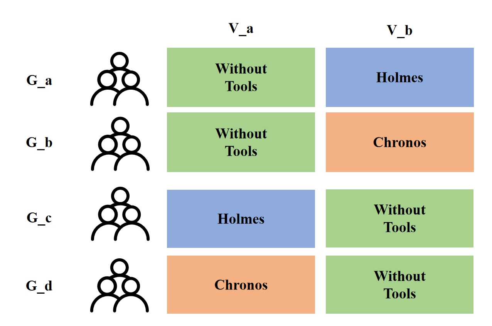

#Setup

We randomly divided 20 people into four groups, denoted as ```G_a```, ```G_b```, ```G_c```, and ```G_d```, and distributed 12 CVEs into two sets, ```V_a``` and ```V_b```. 

```G_a``` and ```G_b``` :
- Initially, ```G_a``` and ```G_b``` individually tagged ```V_a``` without any tool assistance. 

- Subsequently, ```G_a``` utilized Holmes while ```G_b``` used Chronos to tag ```V_b```. 

```G_c``` and ```G_d```:

- Similarly, ```G_c``` and ```G_d``` tag ```V_a``` employed Holmes and Chronos, respectively.
- Subsequently, ```G_c``` and ```G_d``` tagged ```V_b``` without tool assistance.

The process are shown below:
    