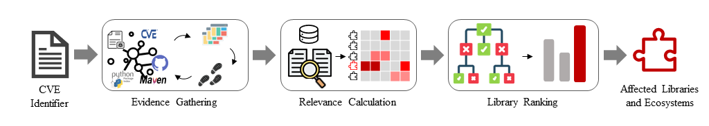

                    \t\t *Framework of Holmes*

Software composition analysis (SCA) tools have been widely adopted to identify vulnerable libraries used in software applications. Such SCA tools depend on a vulnerability database to know affected libraries of each vulnerability. However, it is labor-intensive and error-prone for a security team to manually maintain the vulnerability database. While
several approaches adopt extreme multi-label learning to predict affected libraries for vulnerabilities, they are practically ineffective due to the limited library labels and the unawareness of ecosystems. To address these problems, we first conduct an empirical study to assess the quality of two fields, i.e., affected libraries and their ecosystems, for four vulnerability databases. Our study reveals notable inconsistency and inaccuracy in these two fields. Then, we propose
Holmes to identify affected libraries and their ecosystems for vulnerabilities via a learning-to-rank technique. The key idea of Holmes is to gather various evidences about affected libraries and their ecosystems from multiple sources, and learn to rank a pool of libraries based on their relevance to evidences. Our extensive experiments haveshown the effectiveness, efficiency and usefulness of Holmes.

This paper has been submitted to ICSE 2024.

# Dataset

* large scale dataset
    > [Complete dataset mentioned in Sec 3.1(Vulnerability Database Selection)](Holmes/Empirical_Study/component_ana_log/component_ana_log.zip) (you should unzip the component_ana_log.zip file first and complete_component.json is the dataset)
* GroundTruth
    > [Ground Truth](Holmes/GroundTruth/ground_truth.xlsx)

# Setup

## Holmes Setup
We achieve Holmes in [Holmes](https://github.com/Holmes-Holmes/Holmes-Holmes.github.io/tree/main/Holmes/ApproachImp), you can replicate our result with the guide of [How to start](Holmes/ApproachImp/README.md). If you have any questions or need assistance, please feel free to let us know.

## Other Tools Setup
The hyper parameters that result in FastXML's ,LightXML’s, ZestXML's best performance mentioned in previous work were used. You can start with the [FastXML](https://github.com/soarsmu/ICPC_2022_Automated-Identification-of-Libraries-from-Vulnerability-Data-Can-We-Do-Better/tree/master#FastXML), [LightXML](https://github.com/soarsmu/ICPC_2022_Automated-Identification-of-Libraries-from-Vulnerability-Data-Can-We-Do-Better/tree/master#LightXML), [Chronos](https://github.com/soarsmu/Chronos). 

By the way, when reproducing these works, we have added detailed annotations to [the code along with the trained and tested data](Holmes/Setup) used for the reproduction. Additionally, we have provided a [README](Holmes/Setup/README.md) to assist you in avoiding common pitfalls while reproducing these three projects.


# Experiment
The evaluation contains RQ1, RQ2, RQ3, RQ4, RQ5, RQ6 and RQ7

The RQ3, RQ4 and RQ6 are uploaded to [kaggle](https://www.kaggle.com/datasets/holmesholmes/holmes-experiment), after unzip all file, you can easily replicat the result on our paper.

## RQ1 Consistency Assessment 
```
cd Holmes/Empirical_Study
```
To replicate our results for RQ1, please use:
```
./run.sh Eco
./run.sh Name
```
## RQ2 Accuracy Assessment
To replicate our results for RQ2, please use:
```
cd Holmes/Empirical_Study
./run.sh Acc
```

## RQ3 Effectiveness Evaluation

**Random-Order**
```
cd Holmes/Evaluation/tool_compare/MAP_Metric_random
python map_score.py
```

**Chronological-Order**
```
cd Holmes/Evaluation/tool_compare/MAP_Metric_chronological
python map_score.py
```

## RQ4 Ablation Study

**Random-Order**
```
cd MAP_Metric_ablation_random
python map_score.py
```

**Chronological-Order**
```
cd MAP_Metric_ablation_chronological
python map_score.py
```

## RQ5 Efficiency Evaluation

We count the time costs in **evidence gathering**, **relevance calculation** and **library ranking**.
You can find those part in our [source code](https://github.com/Holmes-Holmes/Holmes-Holmes.github.io/tree/main/Holmes/ApproachImp)

## RQ6 Generality Evaluation

```
cd MAP_Metric_general
python map_score.py
```

## RQ7 Usefulness Evaluation

* **Human Study**

    The detailed result of human study is stored in ```./Holmes/Evaluation/human_study/wiz_tool``` and ```./Holmes/Evaluation/human_study/wizot_tool```;
    The results are calculated and stored in [quality_wiztl.json](Holmes/Evaluation/human_study/quality_wiztl.json) and [quality_wzttl.json](Holmes/Evaluation/human_study/quality_wzttl.json).

* **Vendor Reporting**

    > 64 inaccurate CVEs for GitHub: [Inaccurate-Affected-Components-in-GitHub](Holmes/Evaluation/Reproting/email_send/Github Inaccurate Affected Components.csv)

    > 51 inaccurate CVEs for GitLab: [Inaccurate-Affected-Components-in-GitLab](Holmes/Evaluation/Reproting/email_send/Gitlab Inaccurate Affected Components.csv)

    > 35 inaccurate CVEs for Snyk: [Inaccurate-Affected-Components-in-Snyk](Holmes/Evaluation/Reproting/email_send/Snyk Inaccurate Affected Components.csv)

    > 62 inaccurate CVEs for Veracode: [Inaccurate-Affected-Components-in-Veracode](Holmes/Evaluation/Reproting/email_send/Veracode Inaccurate Affected Components.csv)
