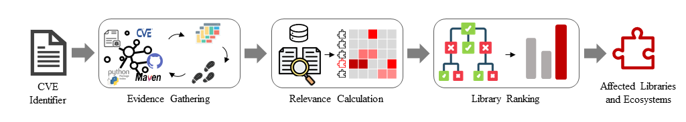

            *Framework of Holmes*

Software composition analysis (SCA) tools have been widely adopted to identify vulnerable libraries used in software applications. Such SCA tools depend on a vulnerability database to know affected libraries of each vulnerability. However, it is labor-intensive and error-prone for a security team to manually maintain the vulnerability database. While
several approaches adopt extreme multi-label learning to predict affected libraries for vulnerabilities, they are practically ineffective due to the limited library labels and the unawareness of ecosystems. To address these problems, we first conduct an empirical study to assess the quality of two fields, i.e., affected libraries and their ecosystems, for four vulnerability databases. Our study reveals notable inconsistency and inaccuracy in these two fields. Then, we propose
Holmes to identify affected libraries and their ecosystems for vulnerabilities via a learning-to-rank technique. The key idea of Holmes is to gather various evidences about affected libraries and their ecosystems from multiple sources, and learn to rank a pool of libraries based on their relevance to evidences. Our extensive experiments haveshown the effectiveness, efficiency and usefulness of Holmes.

This paper has been submitted to ICSE 2024.

# Dataset

* large scale dataset
    > [Complete dataset mentioned in Sec 3.1(Vulnerability Database Selection)](Holmes/Empirical_Study/component_ana_log/tmp_component.json)
* GroundTruth
    > [Ground Truth](Holmes/GroundTruth/pypimavennpmgo_component_tagging_2023_0720_wss.xlsx)

# Empirical Study

## RQ1 Consistency Assessment 
```
cd Holmes/Empirical_Study
```
To replicate our results for RQ1, please use:
```
./run.sh Eco
./run.sh Name
```
## RQ2 Accuracy Assessment
To replicate our results for RQ2, please use:
```
cd Holmes/Empirical_Study
./run.sh Acc
```

<!-- # Approach Implement


## Evidence Gathering


## Lucene -->

# Evaluation
The evaluation contains RQ3, RQ4, RQ5, RQ6 and RQ7

## RQ3 Effectiveness Evaluation

**Random-Order**
```
cd Holmes/Evaluation/tool_compare/MAP_Metric_random
python map_score.py
```

**Chronological-Order**
```
cd Holmes/Evaluation/tool_compare/MAP_Metric_chronological
python map_score.py
```

## RQ4 Ablation Study

**Random-Order**
```
cd MAP_Metric_ablation_random
python map_score.py
```

**Chronological-Order**
```
cd MAP_Metric_ablation_chronological
python map_score.py
```

## RQ5 Efficiency Evaluation

We count the time costs in **evidence gathering**, **relevance calculation** and **library ranking**.
You can find those part in our [source code](./Holmes/ApproachImp)

## RQ6 Generality Evaluation

```
cd MAP_Metric_general
python map_score.py
```

## RQ7 Usefulness Evaluation

* **Human Study**

    The detailed result of human study is stored in [with tool](Holmes/Evaluation/human_study/wiz_tool) and [without tool](Holmes/Evaluation/human_study/wizot_tool);
    The results are calculated and stored in [quality_wztl.json](Holmes/Evaluation/quality_wztl.json) and [quality_wiztl.json](Holmes/Evaluation/quality_wiztl.json).

* **Vendor Reporting**

    > 64 inaccurate CVEs for GitHub: [Inaccurate-Affected-Components-in-GitHub](Holmes/Evaluation/Reproting/Github-Inaccurate-Affected-Components.csv)

    > 51 inaccurate CVEs for GitLab: [Inaccurate-Affected-Components-in-GitLab](Holmes/Evaluation/Reproting/Gitlab-Inaccurate-Affected-Components.csv)

    > 35 inaccurate CVEs for Snyk: [Inaccurate-Affected-Components-in-Snyk](Holmes/Evaluation/Reproting/Snyk-Inaccurate-Affected-Components.csv)
    
    > 62 inaccurate CVEs for Veracode: [Inaccurate-Affected-Components-in-Veracode](Holmes/Evaluation/Reproting/Veracode-Inaccurate-Affected-Components.csv)

<!-- 
# Chronos Lightxml Fastxml

## Dataset
- data preparing
    We follow [chronos], [lightxml] and [fastxml], and replace the dataset with our's. 
    - The script of full list of veracode libraries mentioned in xxx.

    - The website of the referenced data's script is released in xxx.

    To be convenient, we copyed their code into our repo for fastxml and lightxml. And pull a docker image for chronos, then we create a table for you to reproducce the tranging and testing data for random, chrono and geneal dataset


| head1        | Random-Order        | chronological-order   | Generality | 
|:-------------|:-------------|:-------------|:-------------| 
| Chronos      | workspace/Chronos/zero_shot_dataset/tenfold/   | workspace/Chronos/zero_shot_dataset/chronological/          | workspace/Chronos/zero_shot_dataset/general/    | 
| Lightxml     | data/tenfold/     | data/chronological/           | data/general_data/    | 
| Fastxml      | dataset/tenfold_generate/       | dataset/chronological/               | dataset/general   |

To train FastXML, you can use the following command:<br>
```
python baseline.py model/model_name.model {training_data_path} --verbose train --iters 200 --gamma 30 --trees 64 --min-label-count 1 --blend-factor 0.5  --re_split 0 --leaf-probs
```
You can change the third parameter to change the path of training data, for example: <br>
```
python baseline.py model/model_name.model dataset/tenfold_generate/fold_0/train.json --verbose train --iters 200 --gamma 30 --trees 64 --min-label-count 1 --blend-factor 0.5  --re_split 0 --leaf-probs
```

To test the model, you can use the following command: <br>
```
python baseline.py model/model_name.model {test_data_path} inference --score
python util.py
```
Also, you can change the third parameter to change the path of test data. <br>
For generality test, we use `FastXML/dataset/tenfold_generate/fold_0/train.json` to train the model, and `FastXML/dataset/general/deepvul_test_total_general.json` to test the model. <br>
Please refer to https://github.com/soarsmu/ICPC_2022_Automated-Identification-of-Libraries-from-Vulnerability-Data-Can-We-Do-Better/tree/master for more details. <br>

For LightXML, you can manually change the path of training and test data in `/LightXML/src/dataset.py`, line 30, 36, 42, 49. <br>
After changing the data path, you can use the following command to train and test the model. <br>
```
./run.sh cve_data
```
For generality test, we use `/data/tenfold/fold_0/train_general_texts.txt` and `/data/tenfold/fold_0/train_general_labels.txt` to train the model, and test the model on `/data/general_data/general_test_texts.txt` and `/data/general_data/general_test_labels.txt`. <br>
Please refer to https://github.com/soarsmu/ICPC_2022_Automated-Identification-of-Libraries-from-Vulnerability-Data-Can-We-Do-Better/tree/master for more details. <br> -->

For CHRONOS, you can train and test the model by the following command: <br> 
```
bash auto_run.sh -d [description data: "merged" or "description_and_reference"]
                 -t [type of data used in training and testing progress: 'general' or 'chronological' or 'random' or 'fold_X'(X = 0, 1, ..., 9)]
                 -l [label processing: "splitting" or "none"]
                 -m [the M parameter on Equation (6) for adjustment] 
                 -i [top-i highest labels for adjustment]
``` 
For example, to reproduce the general test, you can use the following command: <br>
```
bash auto_run.sh -d 'description_and_reference' -t'general' -l 'splitting' -m 0 -i 0
```
Our source data are: `/workspace/Chronos/dataset/description_data/dataset_merged_cleaned_total_general_test.csv` and `/workspace/Chronos/dataset/reference_data/reference_data_raw_total_general_test.csv`. You can generate the test data from scrach by steps below: 
1. Run `/workspace/Chronos/reference_processing/generate_new_csv.py` and copy the output file `/workspace/Chronos/reference_processing/reference_data_raw_0.5_15_total_general_test.csv` to `/workspace/Chronos/dataset/reference_data/`. 
2. Run functions `zero_shot_data_splitting`, `zero_shot_data_splitting_chronological` and `zero_shot_data_splitting_general` in `/workspace/Chronos/prepare_data.py` to process data. 
3. Use the commands mentioned before to get certain results. 
